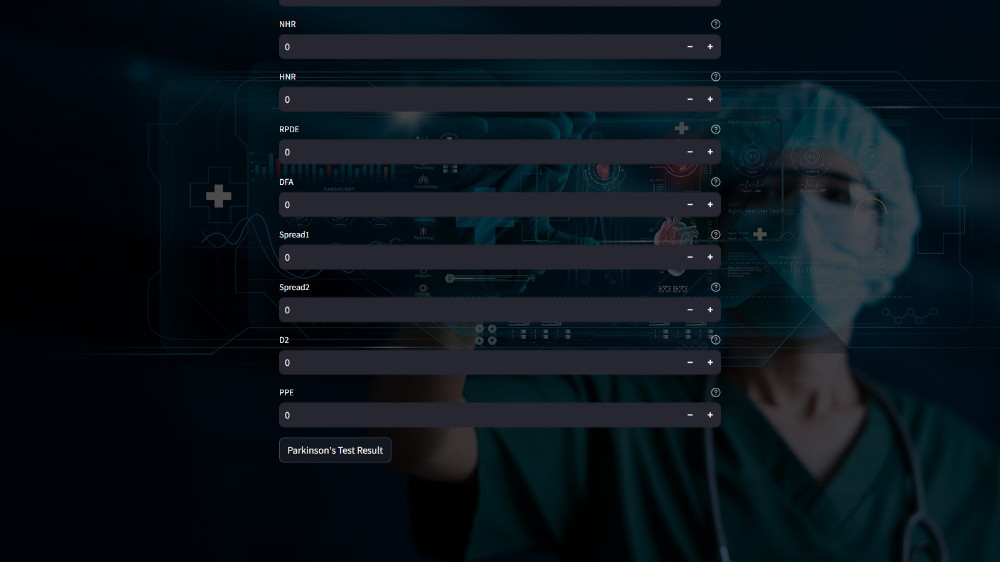
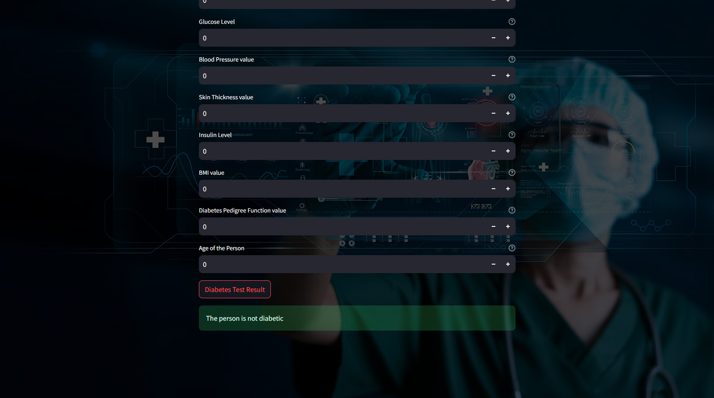

# AI-Based Medical Diagnosis System

## 🌟 Overview
The **AI-Based Medical Diagnosis System** is a machine learning-powered application that assists in the early detection of multiple diseases, including:
- **Heart Disease**
- **Lung Cancer**
- **Thyroid Disorders**
- **Parkinson's Disease**

This system utilizes **Support Vector Machines (SVM), Linear Regression, Logistic Regression, and Random Forest** for accurate predictions. The application is built using **Python** and provides an interactive UI via **Streamlit**.

---

## 🚀 Features
✅ Multi-Disease Diagnosis (Heart, Lung Cancer, Thyroid, Parkinson's)  
✅ Uses **SVM, Logistic & Linear Regression, Random Forest**  
✅ **Streamlit**-powered interactive UI  
✅ User-friendly input form for diagnosis  
✅ **Real-time Predictions** based on user input  
✅ Trained on medical datasets for accurate results  

---

## 🏗️ Tech Stack
- **Programming Language:** Python 🐍
- **Libraries:** `sklearn`, `pandas`, `numpy`, `streamlit`, `pickle`
- **Algorithms:** SVM, Logistic Regression, Linear Regression, Random Forest

---

## 📌 Installation & Setup
1. **Clone the Repository**  
   ```sh
   git clone https://github.com/AnirbanGhosh2503/AI-based-Medical-Diagnosis-System.git
   cd AI-Medical-Diagnosis
   ```

2. **Create a Virtual Environment** (Recommended)  
   ```sh
   python -m venv medical_diagnosis_system
   source medical_diagnosis_system/bin/activate   # On macOS/Linux
   medical_diagnosis_system\Scripts\activate      # On Windows
   ```

3. **Install Dependencies**  
   ```sh
   pip install -r requirements.txt
   ```

4. **Run the Streamlit App**  
   ```sh
   streamlit run app.py
   ```

---

## 📊 Model Training & Usage
1. **Dataset Preprocessing**
   - Load datasets using `pandas`
   - Handle missing values
   - Normalize data using `StandardScaler`
   
2. **Train Models**
   - `SVM` for Parkinson's Disease
   - `Random Forest` for Lung Cancer Detection
   - `Logistic Regression` for Heart Disease
   - `Linear Regression` for Thyroid Detection
   
3. **Model Saving & Deployment**
   - Trained models are saved using `pickle`
   - The models are loaded in `app.py` for real-time predictions

---

## 📸 Screenshots (Optional)
Include screenshots of your Streamlit UI and model outputs here!







---

## 👨‍💻 Contributing
Feel free to contribute to the project! Fork the repository and submit a PR.

---

## 📜 License
This project is licensed under the MIT License.

---

## 📞 Contact
For any questions or suggestions, reach out at [2003anirbanghosh@gmail.com](mailto:your-2003anirbanghosh@gmail.com) or visit the [GitHub Repository](https://github.com/AnirbanGhosh2503/AI-based-Medical-Diagnosis-System).